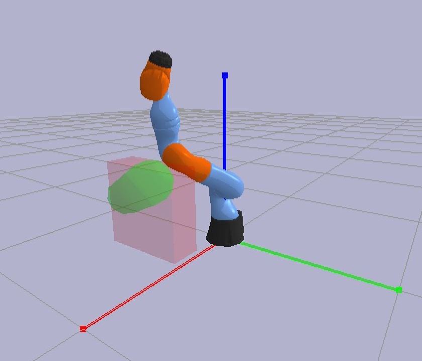
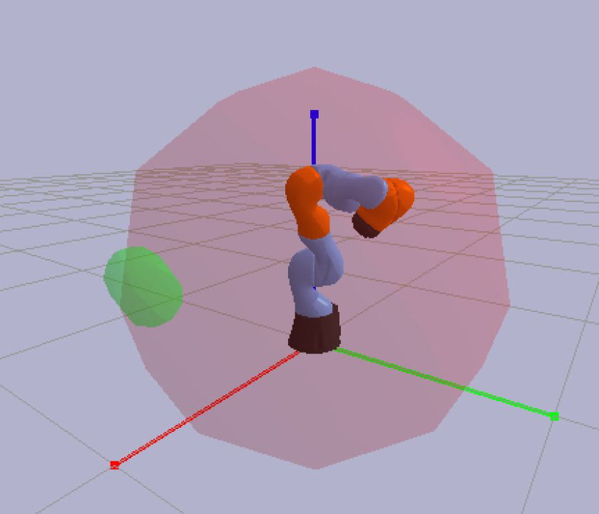

## Learning to Control End Effector Poses with PPO and SAC

_**Haomiao Zhang**, University of British Columbia_

  
   
  

**Abstract:** End effector pose control is crucial in the industries for various tasks. To control end effector poses, inverse kinematics usually would be applied to decompose poses to joint positions for joint level control. While inverse kinematics is effective when the joint dimension low, it becomes difficult and time consuming with the increase of joint dimension. Fortunately, deep reinforcement learning (DRL) has demonstrated its capability in performing motion control with high joint dimension. In this paper, controllers are learned using PPO and SAC to control the end effector poses throuhgh inverse kinematics and joint position control. Training and evaluation are performed on a IIWA robot arm in PyBullet simulation. With the given training time and hyperparameters, the DRL controllers perform statistically better than PD controller when reaching the same target, but the performance decreases when trying to reach different targets within the work envelope. 

**Full report can be found [here]({{ site.baseurl}}/Report.pdf)**

Point Target Demonstration

<iframe width="560" height="315" src="https://www.youtube.com/embed/waMvO225mdo" title="YouTube video player" frameborder="0" allow="accelerometer; autoplay; clipboard-write; encrypted-media; gyroscope; picture-in-picture" allowfullscreen></iframe>

Box Target Demonstration

<iframe width="560" height="315" src="https://www.youtube.com/embed/-9B8OTWW_xc" title="YouTube video player" frameborder="0" allow="accelerometer; autoplay; clipboard-write; encrypted-media; gyroscope; picture-in-picture" allowfullscreen></iframe>

Random Target Demonstration

<iframe width="560" height="315" src="https://www.youtube.com/embed/nyl5V4h27K8" title="YouTube video player" frameborder="0" allow="accelerometer; autoplay; clipboard-write; encrypted-media; gyroscope; picture-in-picture" allowfullscreen></iframe>

